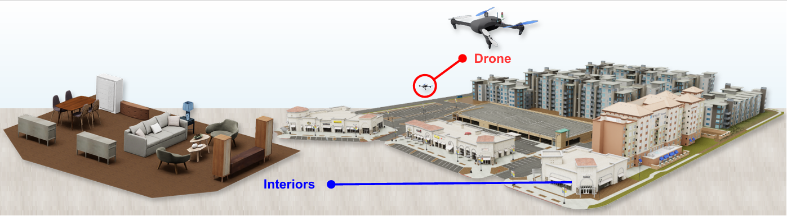
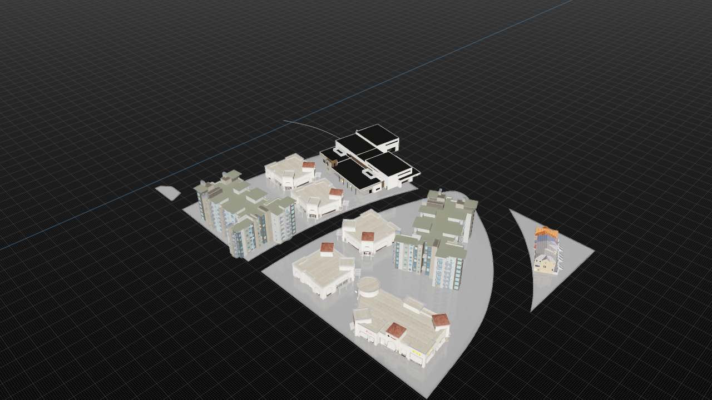
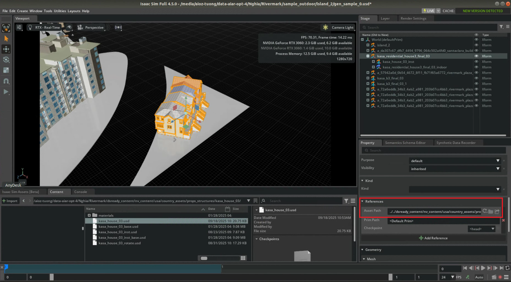
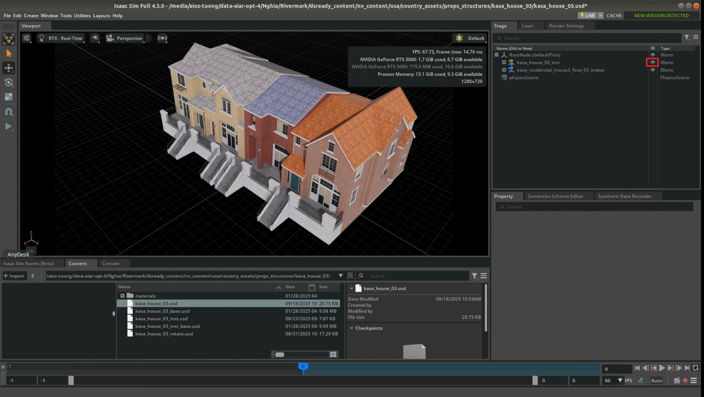
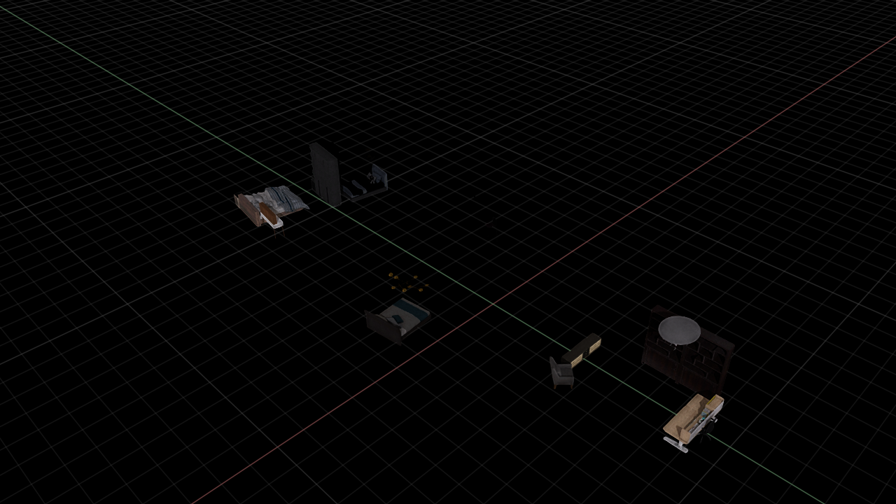

# AeroScene: Progressive Scene Synthesis for Aerial Robotics (ICRA 2026)

### [Nghia Vu](https://scholar.google.com/citations?user=03A3aI8AAAAJ&hl=vi), [Tuong Do](https://scholar.google.com/citations?user=qCcSKkMAAAAJ&hl=en), [Dzung Tran](), [Binh X. Nguyen](https://scholar.google.com/citations?user=KU9vgMcAAAAJ&hl=en), [Hoan Nguyen](), [Erman Tjiputra](https://sg.linkedin.com/in/erman-tjiputra), [Quang D. Tran](https://scholar.google.com/citations?user=DbAThEgAAAAJ&hl=en), [Hai-Nguyen Nguyen](https://hann.work), [Anh Nguyen](https://cgi.csc.liv.ac.uk/~anguyen/)


### [[Project Page](https://aioz-ai.github.io/AeroScene/)] [[Paper](https://arxiv.org/abs/2603.23224)]

This is repo of paper **AeroScene: Progressive Scene Synthesis for Aerial Robotics**


## Abstract
> Generative models have shown substantial impact across multiple domains, their potential for scene synthesis remains underexplored in robotics. This gap is more evident in drone simulators, where simulation environments still rely heavily on manual efforts, which are time-consuming to create and difficult to scale. In this work, we introduce AeroScene, a hierarchical diffusion model for progressive 3D scene synthesis. Our approach leverages hierarchy-aware tokenization and multi-branch feature extraction to reason across both global layouts and local details, ensuring physical plausibility and semantic consistency. This makes AeroScene particularly suited for generating realistic scenes for aerial robotics tasks such as navigation, landing, and perching. We demonstrate its effectiveness through extensive experiments on our newly collected dataset and a public benchmark, showing that AeroScene significantly outperforms prior methods. Furthermore, we use AeroScene to generate a large-scale dataset of over 1,000 physics-ready, high fidelity 3D scenes that can be directly integrated into NVIDIA Isaac Sim. Finally, we illustrate the utility of these generated environments on downstream drone navigation tasks.

*<center> We introduce AeroScene, a progressive scene synthesis method and dataset for aerial robotics. </center>*

## Table of Contents
1. [AeroScene Dataset](#aeroscene-dataset)
2. [Visualizing](#visualizing)


## AeroScene Dataset
**[Download]** The dataset can be downloaded [here](https://huggingface.co/datasets/aiozai/AeroScene)

The structure of dataset is described below: 

- `sample_outdoor`: contains scene samples (`usd` file) and their metadata (`json`) file. 
- `props_mesh`: Mesh file of outdoor buildings 
- `island_mesh`: Floor mesh file in each scene 
- `indoor_rivermark`: contains asset of indoor objects. We reuse the [3D-FRONT](https://arxiv.org/abs/2011.09127) dataset to recreate our indoor assets.
- `dsready_content`: contains references of building objects. 

Each json file follows the structure below: 

```
{
    'id': # sample id , 
    'mesh_floor': # mesh floor id, 
    'outdoor_scene': [
        'name': object id , 
        'translation': translation vector, 
        'rotation': rotation vector, 
        'scale': scale vector, 
        'indoor': null or list of indoor objects, containing translation, rotation and scale infor 
    ]
}
```

## Visualizing
We use [Isaac Sim](https://docs.isaacsim.omniverse.nvidia.com/5.0.0/installation/download.html) to visualize the dataset.

Launch Isaac Sim and open a `.usd` file, for example `sample_outdoor/island_2/gen_sample_0.usd`. Once loaded, the scene will appear as shown below:



The scene includes an outdoor floor along with several outdoor buildings (props). To examine the indoor assets of each building, navigate to the corresponding asset path and open the associated asset files.



You can hide the outdoor assets to better inspect the indoor components of each building.





Additionally, each building (including both indoor and outdoor components) has been extracted into a single mesh in `.glb` format, stored in the `props_mesh` directory. The floor mesh for each scene is also provided separately in the `island_mesh` directory.

## Progress
- **AeroScene Annotation for Indoor-Outdoor Synchronization**: ✅
- **Annotation for Drone Landing**: TBD


## Citation
If you find this work interesting and helpful, please consider citing
```
@inproceedings{vu2026AeroScene,
	title        = {AeroScene: Progressive Scene Synthesis for Aerial Robotics},
	author       = {Vu, Nghia and Do, Tuong and Tran, Dzung and Nguyen, Binh X and Nguyen, Hoan and Tjiputra, Erman and Tran, Quang D and Nguyen, Hai and Nguyen, Anh},
	year         = {2026},
	booktitle    = {ICRA},
}
```

## License
MIT License

